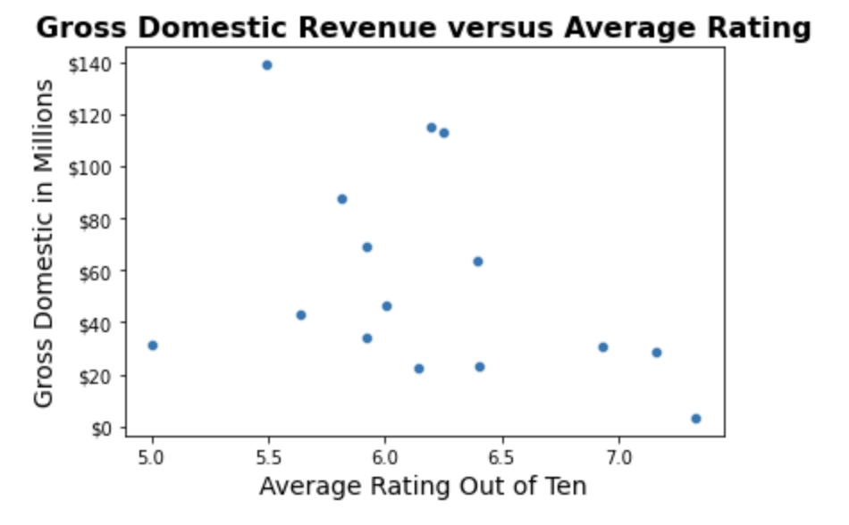

# Microsoft Film Studio - A Needs Analysis

**Authors**: Nicolas Pierce, Ashli Dougherty, Ian Butler

## Overview

This research seeks to answer the question: what films should Microsoft's new film studio make? We utilize data from three primary movie information websites: IMDb, Box Office Mojo, and The Numbers. We aggregate these sources into useable data frames and visualize the features we engineer from them: genres versus ratings, genres versus domestic gross, and genres versus return on investment. Finally, we deliver the results of our research and make confident recommendations: Microsoft's new studio should make either Action/Adventure films or Horror/Mystery/Thriller films, depending on their budget and timeframe.

## Business Problem

Microsoft is creating a new movie studio. Our research is designed to answer the following question:
- What kinds of movies should Microsoft's new movie studio be making?
***
The primary questions we are considering are:
* Which genres of movies do audiences like?
* Is there a relationship between ratings and revenue?
* Which genres of movies have the highest domestic gross revenue?
* Which genres of movies have the highest return on investment?
* Are the highest grossing genres also the highest ROI genres?

***
Questions to consider:
* What are the business's pain points related to this project?
* How did you pick the data analysis question(s) that you did?
* Why are these questions important from a business perspective?
***

## Data

The data we are using comes from three sources:
* IMDb
* Box Office Mojo
* The Numbers
***
These websites are primary sources for aggregated data concerning film characteristics and performance.<br>These are the raw data categories we accessed from each source:
* From IMDb, we accessed movie basics and movie ratings.
* From Box Office Mojo, we accessed movie gross revenue.
* From The Numbers, we accessed movie budgets.

## Methods

Describe the process for analyzing or modeling the data. For Phase 1, this will be descriptive analysis.

***
Questions to consider:
* To prepare the data, we combined tables from several of the data sources, in order to engineer entries with all of the information we were looking for for each title.
* To analyze the data, we aggregated relevant table values by genre, in order to answer questions about highest performing genres and groups of genres, as well as highest returning genres and groups of genres.
* To model the data, we utilized matplotlib and seaborn to demonstrate categorical performance in various elements of film production.
* For these visualizations, we chose to use bar plots almost exclusively as most of our data analysis was categorical in nature, as well as a scatter plot to explore the potential correlation between genre ratings and gross revenue.
* Seeing no apparent relationship, investigation of actual correlation was not necessary.
***

## Results


From what we've gathered above, we can see that Documentaries, Biographies, and Music movies tend to recieve the best ratings, while Horror, Sci-Fi, and Thriller films recieve poorer ratings. While people often use these ratings to form an opinion as to whether or not they will see a movie, we will dive into how heavily ratings may or may not effect the overall profitability of a film.



After looking at the graph above, we thought it would be interesting to see the correlation between movie rating and gross profit, and we can see that there in near no relation.


Based on the data, the highest grossing main genres are **Sci-Fi, Adventure, Animation, Action, Fantasy**. 


***
However, studios produce movies that are labeled under several genres. When looking at the combined genres for the top grossing movies, the data shows that of the highest grossing films, 91% of them are classified as **Action** and/or **Adventure**. The only exception to this would be the movies that are classified as **Horror,Thriller**. 
***
If using this data to determine which types of movies to create, we would suggest **Action** and/or **Adventure** coupled with another other genre will increase the likelihood of a high domestic gross. 


Ultimately, the primary takeaways from exploring the relationship between movie gross and production budget,<br>in terms of profit and return on investment, are these:
 - First: that the relationship between worldwide gross and production budget demonstrates a high margin of profit<br>for movies which combine the following genres together:
     - Adventure, Drama, and Sci-Fi
     - Action, Adventure, and Sci-Fi
     - Comedy and Mystery
<br>Within these collections of genres of movies, the average margin of profit is approximately 500 million dollars.<br>
 - Second: that the relationship between worldwide gross and production budget demonstrates a high return on investment<br>for movies which combine the following genres together:
     - Horror, Mystery, and Thriller
     - Horror
<br>Within these collections of genres of movies, the return on investment is<br>approximately 3622% for Horror, Mystery, and Thriller,<br>and approximately 2783% for Horror.

Present your key results. For Phase 1, this will be findings from your descriptive analysis.

## Conclusions

With respect to the original propsed questions of this research, we found the following:
* Which genres of movies do audiences like?
    * The top-rated genres are **Documentary, Biography, and Music**
* Is there a relationship between ratings and revenue?
    * There is not a strong relationship, positive or negative, between ratings and revenue
* Which genres of movies have the highest domestic gross revenue?
    * The highest domestic-grossing genres are:
        * **Sci-Fi**
        * **Adventure**
        * **Animation**
        * **Action**
    * Additionally, the highest domestic-grossing genres as combinations are:
        * **Action/Adventure**
        * **Horror/Thriller**
* Which genres of movies have the highest return on investment?
    * The highest ROI genre combinations are:
        * **Horror/Mystery/Thriller**
        * **Horror**
* Are the highest grossing genres also the highest ROI genres?
    * Of the highest grossing genres, the ones that have the most amount of overlap with highest ROI are:
        * **Horror**
        * **Thriller**
***
Based on our research, we recommend that Microsoft's new film studio create movies that are either **Action/Adventure** movies or **Horror/Mystery/Thriller** movies, depending on the budget of the studio and the number of films made in a given period. If Microsoft has the capacity for high-budget films, **Action/Adventure** films will make more money with respect to profit margin. If Microsoft has the capacity to work on a high volume of films at once, **Horror** and **Thriller** films will yield a significantly higher return on investment, compared to **Action/Adventure** films, but with a lower profit margin per film. After a film in these genres is released, you can expect it to receive an average rating of **6/10** if it is an **Action** or **Adventure** film, and an average rating of **5/10** if it is a **Horror** film.

## For More Information

Please review our full analysis in [our Jupyter Notebook](./microsoft-movie-analysis.ipynb) or our [presentation](./microsoft-movie-presentation.pdf).

For any additional questions, please contact **Nic: pierce1798@gmail.com , Ashli: ashli.d.dougherty@gmail.com , Ian : ianbutleremail@gmail.com**

## Repository Structure

Describe the structure of your repository and its contents, for example:

```
├── README.md                           <- The top-level README for reviewers of this project
├── dsc-phase1-project-template.ipynb   <- Narrative documentation of analysis in Jupyter notebook
├── DS_Project_Presentation.pdf         <- PDF version of project presentation
├── data                                <- Both sourced externally and generated from code
└── images                              <- Both sourced externally and generated from code
```
